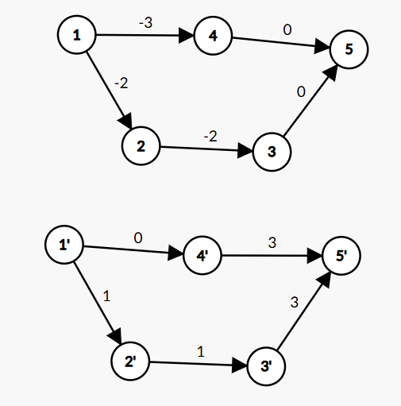

# 浅谈 Johnson 算法

前置知识：Bellman-Ford（也可以是 SPFA）算法，Dijkstra 算法，全源最短路的定义。

求一个有向图（无向图也行）的全源最短路，可能有负边。

显而易见地，我们可以跑 Floyd，时间复杂度 $\mathcal O(n^3)$。但是我们有更好的做法！

首先我们可以把问题转化为一个连通分量的问题，还可以跑 SPFA 判断是否有负环（有就报告有负环）。然后呢？

如果没有负权边则可以用 $n$ 次 Dijkstra 算法，时间复杂度是 $\mathcal O(nm\log n)$（二叉堆优化，Fib 堆可以做到 $\mathcal O(nm+n^2\log n)$）。但是如果有负权边怎么办？

Johnson 的思想就是，构造一个图，和原本的图拥有着相同的最短路性质（原图中的任意一条最短路在新图中还是最短路，只不过边权可能不一样），但是边权都是正数！这个技术称之为重新赋予边权，在一些其它题目中也有使用（但并不是很多）。

我们第一眼想到的思路就是全部平移，像我们在一些数列题上做的一样。但是这样是错的，因为边数不同的路径平移量都不一样，比如下面的例子就会出锅：

（不带 $'$ 的是原图，带 $'$ 的是平移 $+3$ 的图，其实平移任何 $>1$ 的数字都能复现此问题）原图中 $1\leadsto 5$ 最短路是 $1\to 2\to 3\to 5$ 而平移后最短路是 $1\to 4\to 5$。

看来加上一个固定量是不行了。那既然不固定，我们考虑能不能让几次加的值抵消？

那么思路就是给每个店赋一个权值 $h_i$，而每个边 $u\stackrel{w}{\longrightarrow}v$ 都变成 $u\stackrel{w+h_u-h_v}{\longrightarrow}v$，这样边权的增量就会互相抵消，最后 $x_1\to x_2\to x_3\to \dots \to x_k$ 总权值就变成了原本的总权值加上 $h_1-h_k$！这是一个常数！所以只要起点和终点相同，则所有路径长度都只是平移了而已！最短路还是最短路，非最短路还是非最短路！我们就只需要看看 $h_i$ 怎么设计就行了。也就是说，对于每条边 $u\stackrel{w}{\longrightarrow}v$，都需要满足 $w+h_u-h_v\ge 0$。

我们学过三角形不等式：设 $d$ 为从任意一个点出发的最短路，则对于每条边 $u\stackrel{w}{\longrightarrow}v$ 都满足 $d_u+w\ge d_v$（证明非常简单，如果 $d_u+w<d_v$，则从起点走到 $u$ 再走到 $v$ 会比最短路要短，但是起点走到 $u$ 再走到 $v$ 是一条合法路径，所以矛盾！），移项得到 $w+d_u-d_v\ge 0$，所以 $d$ 可以用作 $h$！

另外既然是最短路，我们就没必要对于每个连通块跑一遍最短路，而是建一个超级源点 $0$ 然后整体跑一遍最短路。最短路因为原图中可能有负权则使用 SPFA（或 Bellman-ford，其实是一个东西啦），还能够顺便把负环判了。

最终时间复杂度：SPFA $\mathcal O(nm)$，$n$ 次 Dijkstra $\mathcal O(nm\log n)$，总时间复杂度是 $\mathcal O(nm\log n)$ 的。

不过涉及到最短路就想要提一嘴斐堆（就是斐波那契堆）优化的 Dijkstra 算法，可以把 Johnson 优化到 $\mathcal O(nm+n^2\log n)$。

不过涉及到最短路就想要提一嘴 SPFA 冷门优化 SLF+swap（参见大佬 @[fstqwq](https://www.zhihu.com/people/FirstLast) 的 [知乎回答](https://www.zhihu.com/question/292283275/answer/484871888)）。可以[过【模版】单源最短路径（标准版）](https://www.luogu.com.cn/record/230937183)（洛谷 P4779）！（目前能过，但是好像是凭着优秀的常数通过了 hack #6，跑了 $955\mathrm{ms}$，以后被卡了不关我的事）

不过涉及到最短路就想要提一嘴神级最短路科技，在线性时间内解决非负整数权值的无向图最短路问题，但是太难了我不会。如果在无向图上跑全源最短路可以用这玩意儿优化到 $\Theta(nm)$（用这个科技取代 Johnson 中的 Dijkstra）。
