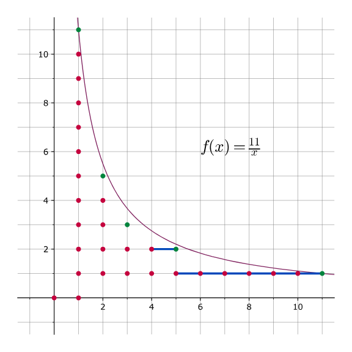

# 数论分块 / 数论整除分块 / 整除分块

## 求 [$H(n)$](https://www.luogu.com.cn/problem/UVA11526)

其实是假的 $H(n)$，加了个整除。是 $\displaystyle\sum_{i=1}^n\left\lfloor\dfrac{n}{i}\right\rfloor$，而不是 $\displaystyle\sum_{i=1}^n\dfrac{n}{i}$。

看上去非常不好做是不是？借用一张 OI-wiki 的图，这题的几何意义（数点）：



（不要管左下角那两个点）

发现 $\left\lfloor\dfrac{n}{i}\right\rfloor$ 有很多的重复。显然最多有 $2\sqrt{n}$ 个不同的值，于是考虑分块。

对于每个不同值分块。使用两个变量 `l` 和 `r` 维护块。那么给定了 $l$，如何求 $r$？

也就是我们要求最大的 $r$ 满足 $\left\lfloor\dfrac{n}{r}\right\rfloor=\left\lfloor\dfrac{n}{l}\right\rfloor$。

设 $k=\left\lfloor\dfrac{n}{l}\right\rfloor$，则有 $k\le \dfrac{n}{r}<k+1$，所以 $\dfrac{n}{k+1}<r \le\dfrac{n}{k}$。故 $r$ 最大值是 $\left\lfloor\dfrac{n}{\left\lfloor\dfrac{n}{l}\right\rfloor}\right\rfloor$。神奇吧！

我们就可以愉快地写出这题的关键代码了。

```cpp
void solve()
{
    long long n;
    scanf("%lld", &n);
    long long sum = 0;
    for(long long l = 1, r; l <= n; l = r + 1)
    {
        r = n/(n/l); // 显然，n/(n/l) <= n。
        sum += (r - l + 1) * (n / l);
    }
    printf("%lld\n", sum);
}
```

[record](https://www.luogu.com.cn/record/224983532)。

## 拓展 - 完全体

我们求 $\displaystyle\sum_{i=1}^n \left\lfloor\dfrac{n}{i}\right\rfloor f(i)$。

思路完全一样，给定 $l,r$ 时 $f$ 可以用前缀和解决。
