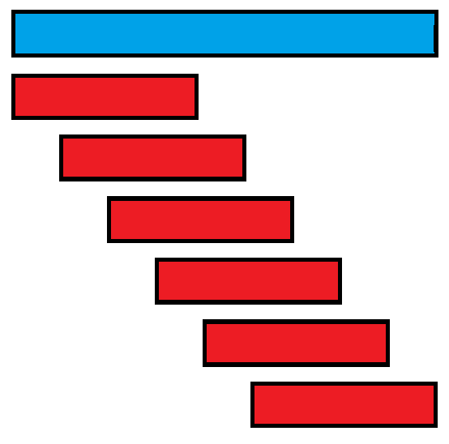

# A Friendly Introduction to KMP Algorithm

> KMP 的核心思想是，用自己匹配自己。

## 设计思路

我们先不考虑抽象的第二问（border），先来考虑第一问。

为了方便，我们令 $n=\lvert s_1 \rvert,m=\lvert s_2 \rvert$。

一个朴素的想法就是，枚举每个 $l$。

这个想法非常好，可惜时间复杂度为 $\mathcal O(nm)$（且并非 $o(nm)$，可以用文本串 $k-1$ 个 `a` + $1$ 个 `b`，模式串 $r$ 个 `a` + $1$ 个 $b$ 来卡掉）。显然会 TLE。

我们观察暴力匹配的过程。能否优化？



我们发现，其实这里有不必要的判断过程。或者说，我们在前面的判断中得到了一些信息，但是根本没用上！比如匹配：

```plaintext
文本串      aaabaaabaaabaaabaaabaab
模式串      aaabaaabaab
匹配过程：
aaabaaabaaabaaabaaabaab
aaabaaabaaX
 aaX
  aX
   X
    ...
note: X 表示匹配失败
```

我们第一次尝试匹配的时候得到了前 $10$ 位（`aaabaaabaa`）匹配，但是第 $11$ 位不匹配。接下来我们将字符串右滑一位，继续尝试。但是，这样浪费了我们第一次获得的信息！

对于得到的 `aaabaaabaa` 我们发现，前 $9$ 位和后 $9$ 位并不相同。这样导致了什么？

```plaintext
aaabaaabaaabaaabaaabaab
aaabaaabaa
 aaabaaabaa
```

第二次匹配必然是不能够匹配的。这是因为，我们得到了整个 `aaabaaabaa` 和原串第一位匹配的信息，匹配的意思就是相等。而如果右滑一位，则右滑之后的前九位要和原串从第二个字符开始的前九位相同。而原串从第二个字符开始的前九位，就是从第十位开始往前的九位！而这个就是 `aaabaaabaa` 的后九位！这两个是不相同的。

相应地，向后两位也不能匹配。因为 `aaabaaabaa` 的前八位要和字符串从第三位开始的八位匹配，也就是第十位开始往前的八位，也就是 `aaabaaabaa` 的后八位。以此类推，直到 `aaabaaabaa` 的某个前缀和其长度相同的后缀相等为止。但是如果没有相同的部分，我们就可以发现空串等于空串，所以直接跳过所有位，从失配的地方继续匹配。

更妙的是，因为我们知道其前缀和长度相同的后缀相等，所以我们可以直接不比较这一部分！优化过后的比较如下：

```plaintext
aaabaaabaaabaaabaaabaab
aaabaaabaaX              ; 此时跳 4 位
    IIIIIIabaaX          ; 还是跳 4 位，和刚才情形相同
        IIIIIIabaaX
            IIIIIIabaab  ; 成功匹配

note: I 表示 Ignored 跳过，不需要测试。
```

我们就可以定义 $l_i$ 为对于模式串前 $i$ 位，满足长度为 $x$ 的前缀和长度为 $x$ 后缀相等的最大 $x$，同时满足 $x<i$（如果是原串就没有意义了。此时对应字符串滑动 $0$ 位）。如果找不到，则是 $0$。比如，刚刚的模式串 `aaabaaabaab` 满足 $l_{10}=6$，所以我们应该向后滑动 $10-6=4$ 位。

不难发现，文本串每一个对应字符最多只会被比较 $2$ 次。所以，我们直接得到了一个 $\mathcal O(n+m)$ 的算法？只剩下一个问题了：$l$ 怎么求？

我们先忽略其问题，给出代码。

### 代码实现（一半）

```cpp
unsigned stringFind(string x, string y)
{
    /*
    神秘的代码，求出了 l。
    */
    int i = 0, j = 0; // i: 匹配到了文本串的哪一位。j: 是用模式串中的哪一位匹配 x[i] 的。
    while(i < x.size())
    {
        if(x[i] == y[j])
        {
            // 匹配成功！
            i++; j++;
            // 整个字符串匹配完毕！
            if(j == y.size()) return i - j;
        }
        else
        {
            // 匹配失败！
            // 通常我们是，换一位重新匹配。也就是 j = l[j]。
        }
    }
    return 0u - 1u; // 匹配失败
}
```

我们接下来给出 $l$ 的一个递推策略，然后揭晓其名称。
