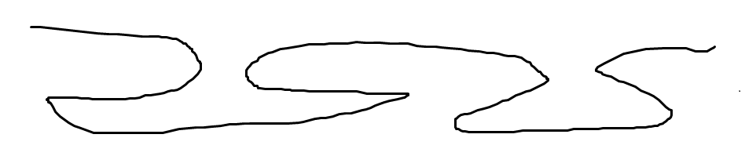

# Atcoder AGC007 D 题解

好题，所以来写一发题解。

初看没有任何头绪，因为可以乱走。

但是实际上，一个点不会被走到 $4$ 次（及以上）。这是因为，如果去一次回来一次再去一次再回来一次，那么第一次去就把前面的全激活了，回来就把一些金币领取了，然后再去激活后面的东西，然后再回来领，那还不如把中间的回来再出去的过程省掉，用这些时间做其他事情呢！然后回来的时候把两次的一起领取了。这样必然不劣，读者自证不难$%——漫士$。

所以最优路径必然长这样：

那么就可以用 $f_{i,j}$ 来表示“走到了前 $i$ 个且前 $i$ 个熊都被激活，领取了前 $j$ 个熊的金币”。这样状态数会爆炸，不行 ${}^1$。

这样做的本质是把下面这个路径作为一个基本单元：

实际上我们可以把这个作为基本单元：

这样就会导致 $i=j$，成功将状态数缩减为 $\Theta(n)$。

那么如何进行状态转移？

## 注释

${}^1$：也不是一定不行，我做过状态数爆炸但是一些状态转移非常简单导致可以直接追溯到使用的不简单的状态，这样缩减状态数，然后能过的题。
